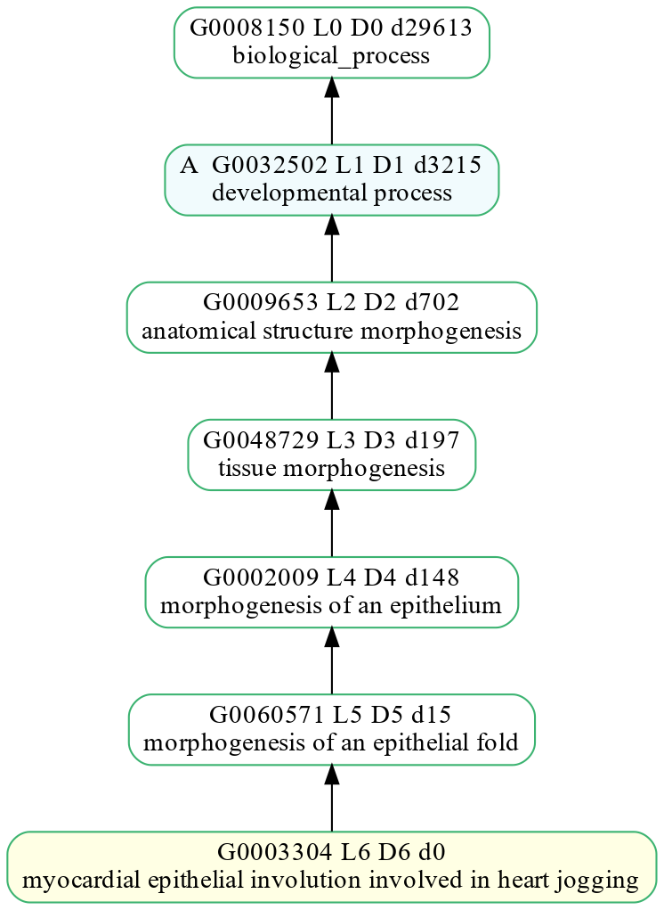
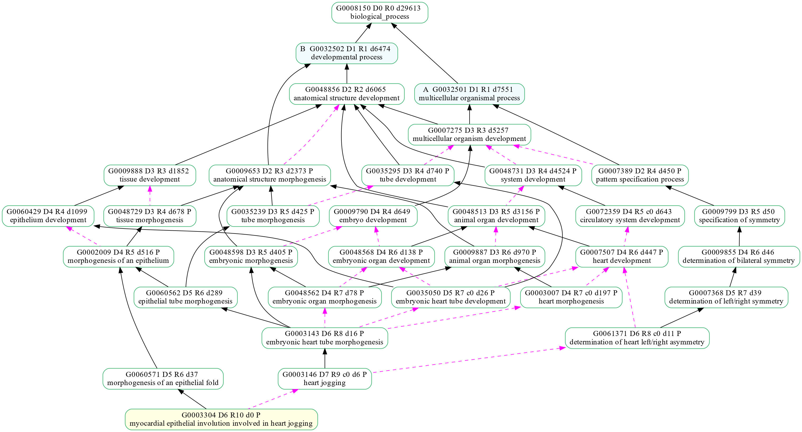
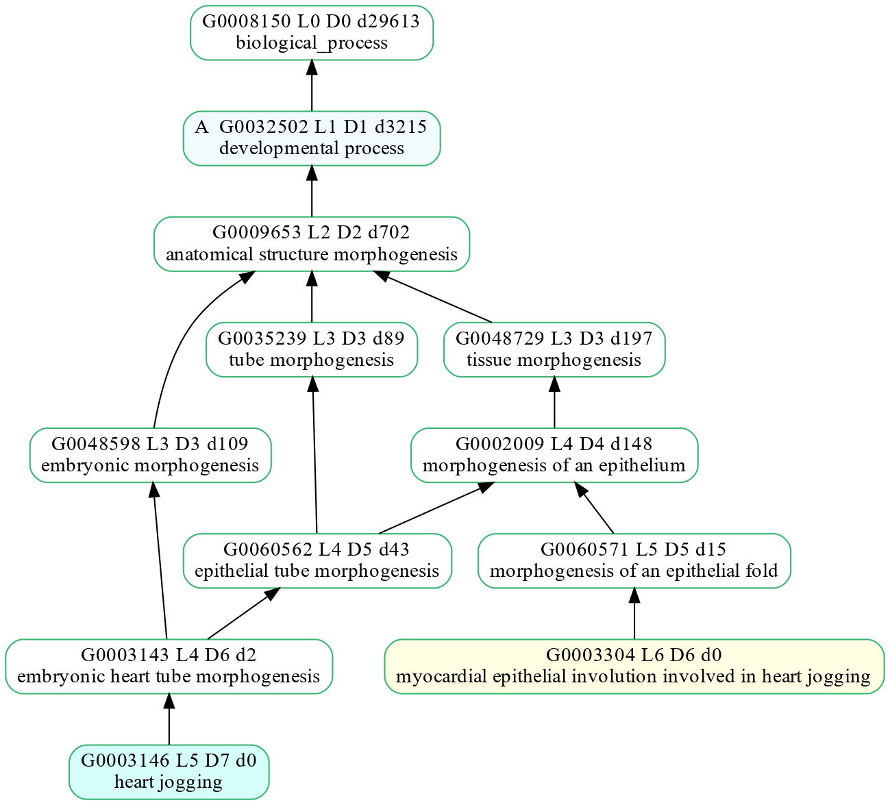

# Plot the GO hierarchy with go_plot.py

  * [**Plot six GO terms in a file (a different color for each) and their ancestors**](#plot-six-go-terms-listed-in-a-file-using-different-colors-and-their-ancestors):
    * [Using 'is_a' relationship only (default)](#six-different-colored-go-terms-without-relationships)
    * [Using all relationships](#six-different-colored-go-terms-with-relationships)
  * Plot **one** GO term and its ancestors:
    * [Using 'is_a' relationship only (default)](#plot-one-go-term-and-its-ancestors)
    * [Using all relationships](#plot-one-go-term-and-its-ancestors-with-relationships)
  * Plot **two** GO terms and their ancestors:
    * [Using 'is_a' relationship only (default)](#plot-two-go-terms-and-their-ancestors)
    * [Using all relationships](#plot-two-go-terms-and-their-ancestors-with-relationships)
  * Plot **two** GO terms (a different **color** for each) and their ancestors:
    * [GO terms listed in a file](#plot-two-go-terms-listed-in-a-file-using-different-colors-and-their-ancestors)
    * [Using 'is_a' relationship only (default)](#plot-two-go-terms-using-different-colors-and-their-ancestors)
    * [Using all relationships](#plot-two-go-terms-using-different-colors-and-their-ancestors-with-relationships)


## Plot six GO terms (listed in a file) using different colors and their ancestors
The colorized GO terms use the colors from the [lightbright](http://www.color-hex.com/color-palette/51895) color palette
and an orange (#ffe5b4) from the [favorite pink based oranges](http://www.color-hex.com/color-palette/50573) color palette.

The file, **go_heartjogging6.txt**, contains the GO terms and user-defined colors:
```
#fad2fa GO:0072359  # BP 643 D04 circulatory system development (magenta)
#d2fafa GO:0003007  # BP 197 D04 heart morphogenesis (blue)
#fafad2 GO:0035050  # BP  26 D05 embryonic heart tube development (yellow)
#ffe5b4 GO:0003304  # BP   0 D06 myocardial epithelial involution involved in heart jogging (orange)
#e6fad2 GO:0061371  # BP  11 D06 determination of heart left/right asymmetry (green)
#d2d2fa GO:0003146  # BP   6 D07 heart jogging (purple)
```
### Six different-colored GO terms without relationships
The six GO IDs listed in _go_heartjogging6.txt_ and their ancestors up to the root GO are plotted.   
```
scripts/go_plot.py --go_file=tests/data/go_plot/go_heartjogging6.txt -o heartjogging6_r0.png
```


### Six different-colored GO terms with relationships
The **-r** argument causes relationships to be plotted.    
```
scripts/go_plot.py --go_file=tests/data/go_plot/go_heartjogging6.txt -r -o heartjogging6_r1.png
```


## Plot one GO term and its ancestors
Plot one term and all ancestors using the 'is_a' attribute.    
```
scripts/go_plot.py GO:0003304
```



## Plot one GO term and its ancestors (with relationships)
Plot one term and all ancestors using the 'is_a' attribute and all relationships (--r).    
The 'part_of' relationships are represented by dashed magenta arrows.    

```
scripts/go_plot.py GO:0003304 --r
```



## Plot two GO terms and their ancestors
Plot two terms and all ancestors using the 'is_a' attribute.        
```
scripts/go_plot.py GO:0003304 GO:0003146 -o heart_jogging.png
```


## Plot two GO terms and their ancestors (with relationships)
Plot two terms and all ancestors using the 'is_a' attribute and all relationships (--r).    
The 'part_of' relationships are represented by dashed magenta arrows.    

```
scripts/go_plot.py GO:0003304 GO:0003146 --r -o heart_jogging_r1.png
```


## Plot two GO terms (listed in a file) using different colors and their ancestors
Plot two terms and all ancestors using the 'is_a' attribute.
The heart jogging GO term, GO:0003146, is colored in [ice](://klaash.github.io/xkcdcolorpicker/#ice).

The file, _go_file1.txt_, contains the GO terms and user-defined colors:
```
GO:0003304
GO:0003146 #d6fffa http://klaash.github.io/xkcdcolorpicker/#ice
```
```
scripts/go_plot.py --go_file=tests/data/go_plot/go_file1.txt -o heart_jogging_ice_gofile1.png
```


## Plot two GO terms using different colors and their ancestors
Plot two terms and all ancestors using the 'is_a' attribute.        
The heart jogging GO term, GO:0003146, is colored in [ice](http://klaash.github.io/xkcdcolorpicker/#ice).    
```
scripts/go_plot.py GO:0003304 GO:0003146#d6fffa -o heart_jogging_ice.png
```



## Plot two GO terms using different colors and their ancestors (with relationships)
Plot two terms ('heart jogging' (GO:0003146) colored in [ice](http://klaash.github.io/xkcdcolorpicker/#ice)) and all ancestors using the 'is_a' attribute and all relationships (--r).    
The 'part_of' relationships are represented by dashed magenta arrows.    

```
scripts/go_plot.py GO:0003304 GO:0003146#d6fffa --r -o heart_jogging_ice_r1.png
```


Copyright (C) 2010-2018, DV Klopfenstein, Haibao Tang et al. All rights reserved.
