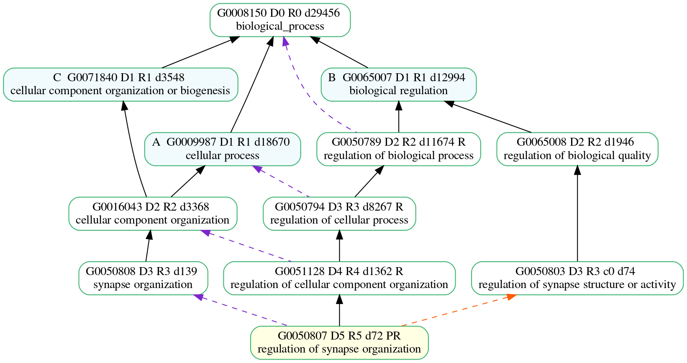
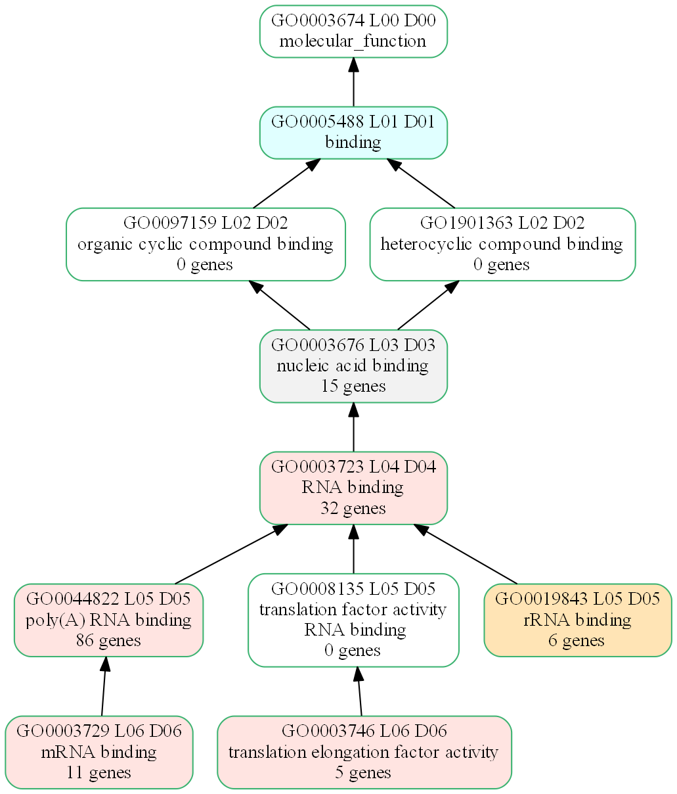
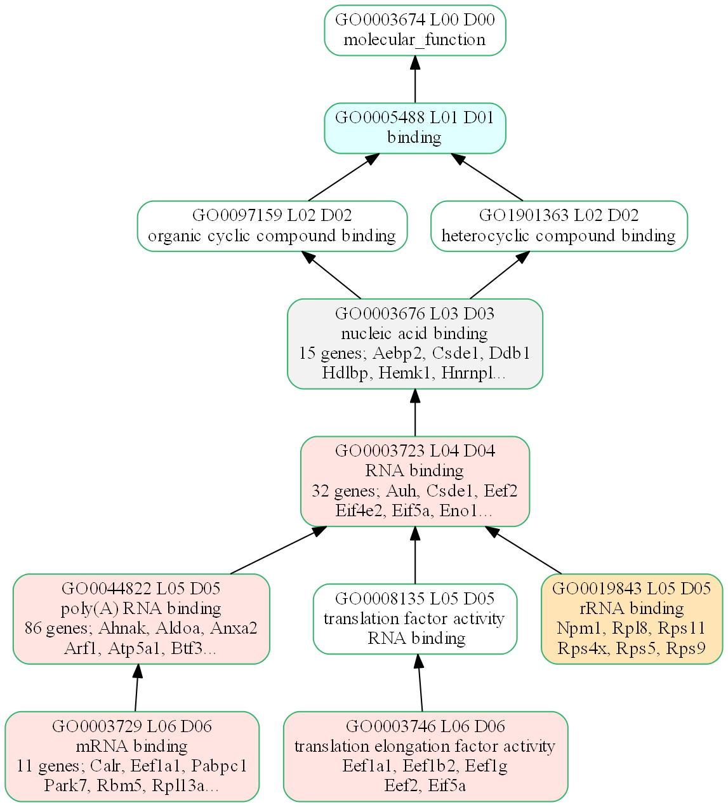
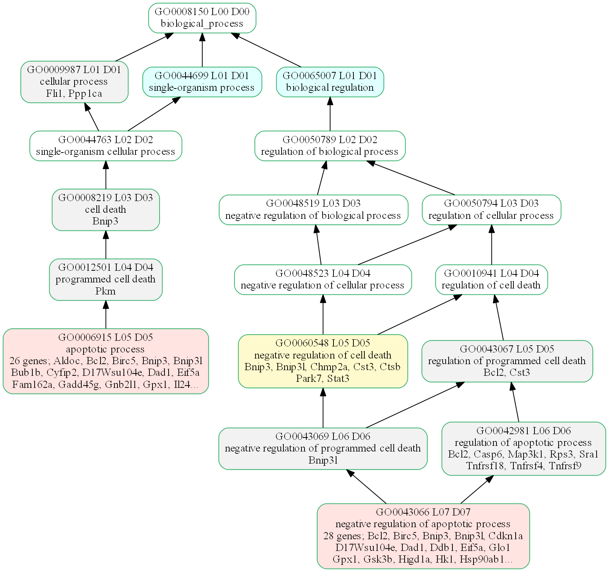

# Notebook Images

# GO parents

## Nature paper GOEA results

### All Cellular Components
Big messy spaghetti plot. *Molecular function* and *Biological process* plots are bigger and messier.    
Colors indicate GOEA pvalues:
  * pval < 0.005 (light red)
  * pval < 0.01 (light orange)
  * pval < 0.05 (yellow)

### A subplot of GOEA results
As well as printing the big plot shown above. You can also create a sub-plot.    
Study gene counts are annotated to plots. e.g, *32 genes*

### A subplot of GOEA results
Instead of gene counts, shows a sampling of study gene Symbols on GO term boxes.    
e.g., *32 genes; Ayh, Csdel, Eef2*

### A subplot showing signficant GO terms related to apoptosis

Copyright (C) 2010-2018, H Tang et al. All rights reserved.
