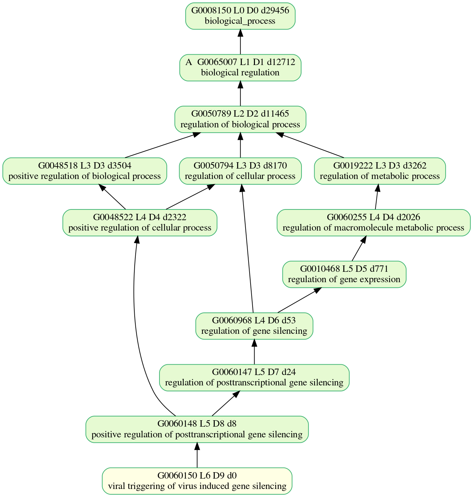
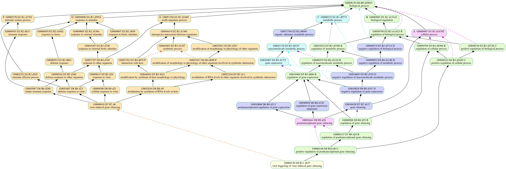
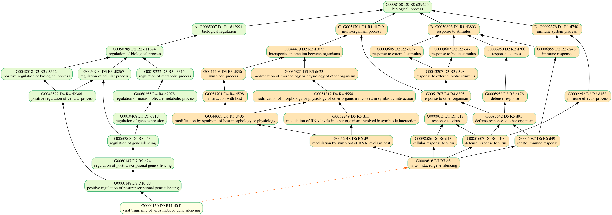
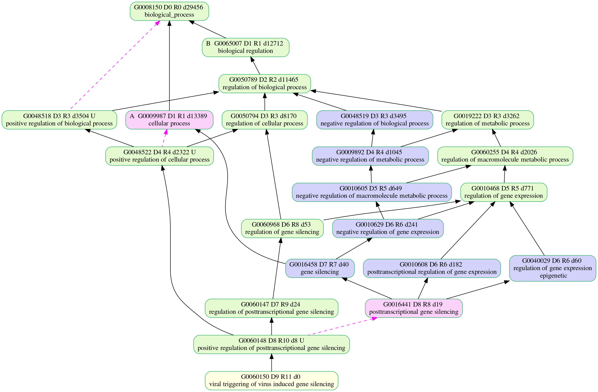
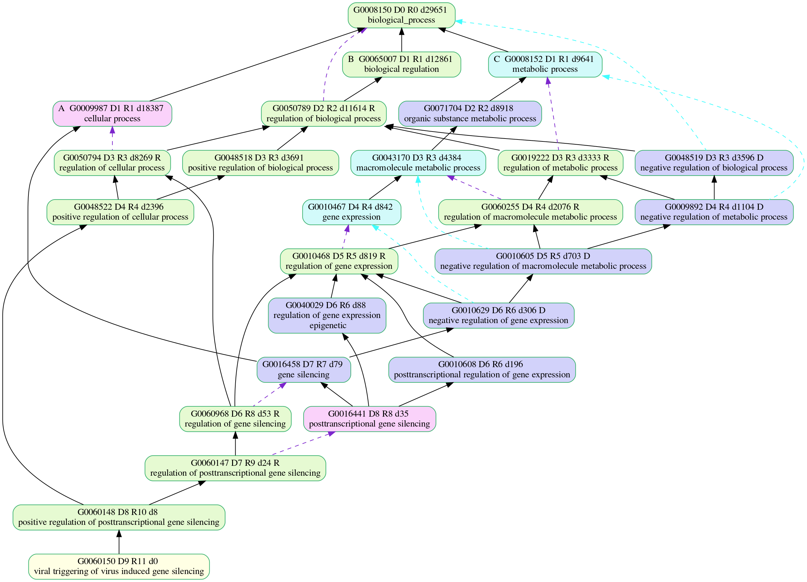
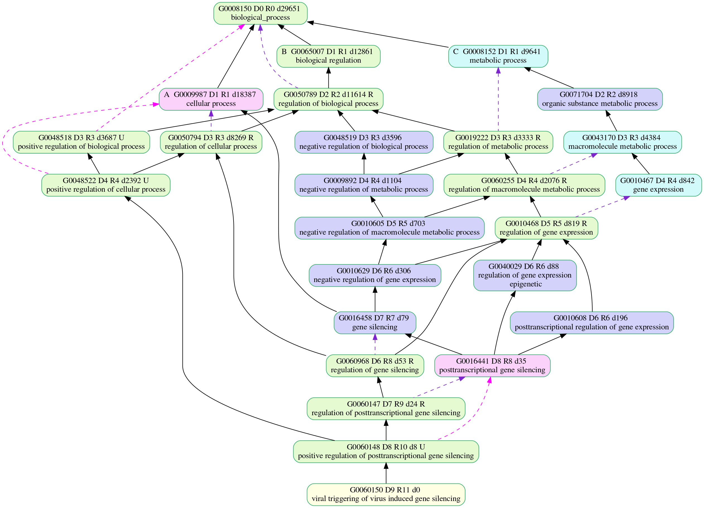
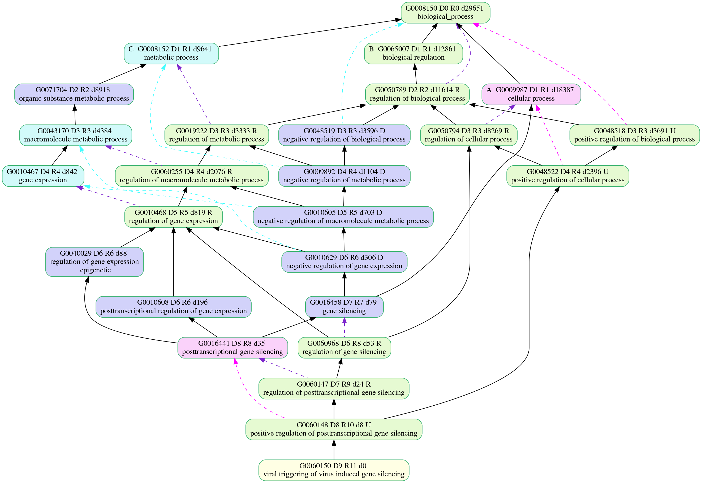

# Plots of [viral_gene_silence.obo](viral_gene_silence.obo)

## viral_r0

## viral_r1

## viral_r_partof

## viral_r_regp

## viral_r_regrn

## viral_r_regrp

## viral_r_regrpn

Copyright (C) 2016-present, DV Klopfenstein & Haibao Tang. All rights reserved.
