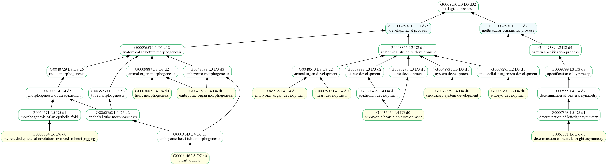
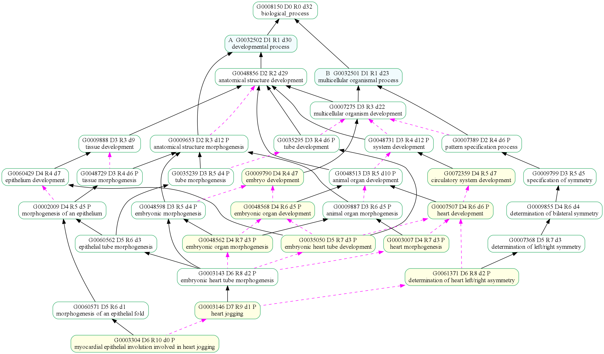

# heartjogging.obo
Figures showing a subset of GO terms related to 'heartjogging.'

  * [**'Heartjogging' GO terms without relationships loaded**](#heartjogging-go-terms-without-relationships-loaded)    
    % go_plot --obo=tests/data/heartjogging.obo -o tests/data/images/heartjogging_r0.png

  * [**'Heartjogging' GO terms with relationships loaded**](#heartjogging-go-terms-with-relationships-loaded)    
    % go_plot --obo=tests/data/heartjogging.obo -o tests/data/images/heartjogging_r1.png -r

## 'Heartjogging' GO terms without relationships loaded
% go_plot --obo=tests/data/heartjogging.obo -o tests/data/images/heartjogging_r0.png

## 'Heartjogging' GO terms with relationships loaded
% go_plot --obo=tests/data/heartjogging.obo -o tests/data/images/heartjogging_r1.png -r

| Color   | relationship         |
|---------|----------------------|
|magenta  | part_of              |
|purple   | regulates            |
|red      | positively regulates |
|blue     | negatively regulates |

Copyright (C) 2010-2018. Haibao Tang et al. All rights reserved.
