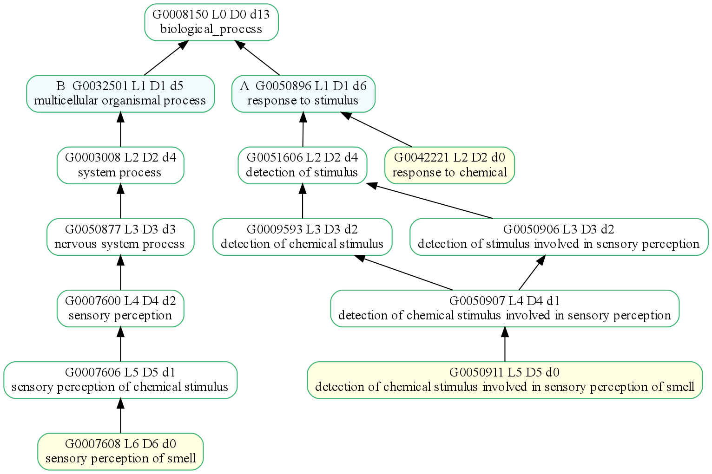
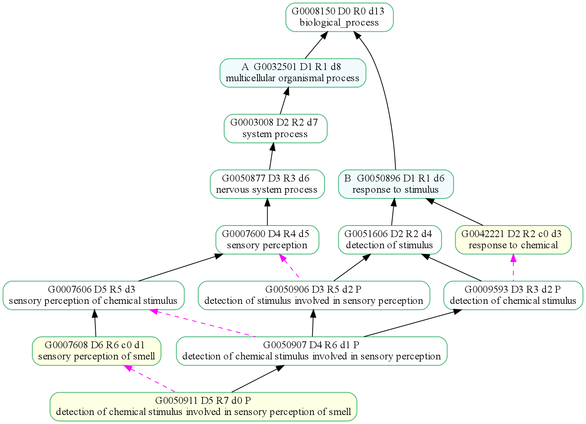

# smell.obo
Figures showing a subset of GO terms related to 'smell.'

  * [**'Smell' GO terms without relationships loaded**](#smell-go-terms-without-relationships-loaded)    
    % go_plot --obo=tests/data/smell.obo -o tests/data/images/smell_r0.png

  * [**'Smell' GO terms with relationships loaded**](#smell-go-terms-with-relationships-loaded)    
    % go_plot --obo=tests/data/smell.obo -o tests/data/images/smell_r1.png -r

## 'Smell' GO terms without relationships loaded
% go_plot --obo=tests/data/smell.obo -o tests/data/images/smell_r0.png

## 'Smell' GO terms with relationships loaded
% go_plot --obo=tests/data/smell.obo -o tests/data/images/smell_r1.png -r

| Color   | relationship         |
|---------|----------------------|
|magenta  | part_of              |
|purple   | regulates            |
|red      | positively regulates |
|blue     | negatively regulates |

Copyright (C) 2010-2018. Haibao Tang et al. All rights reserved.
