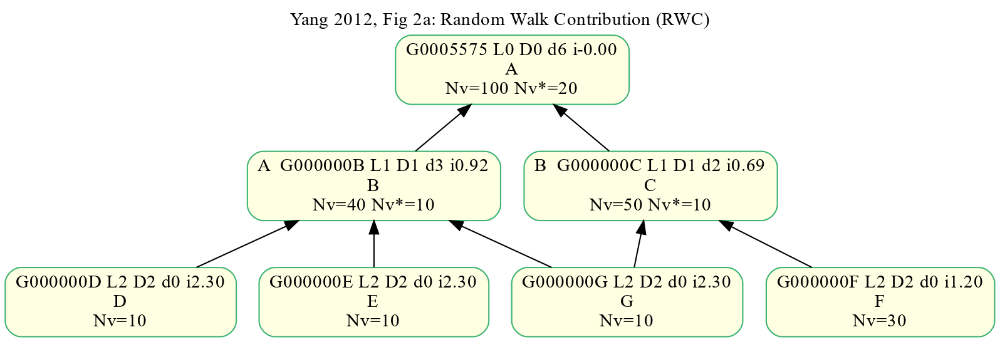
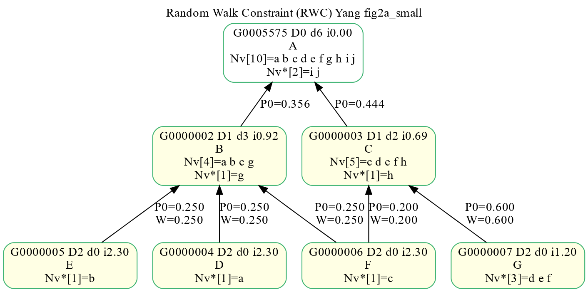
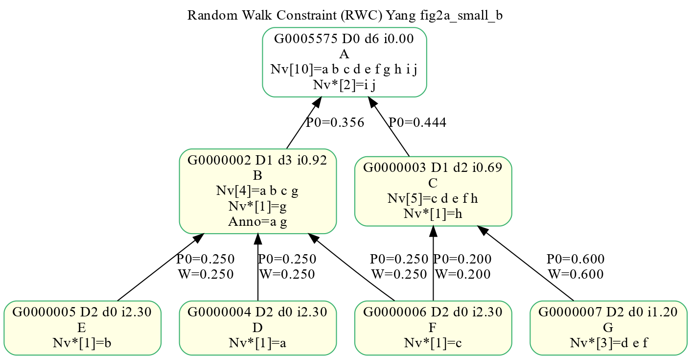
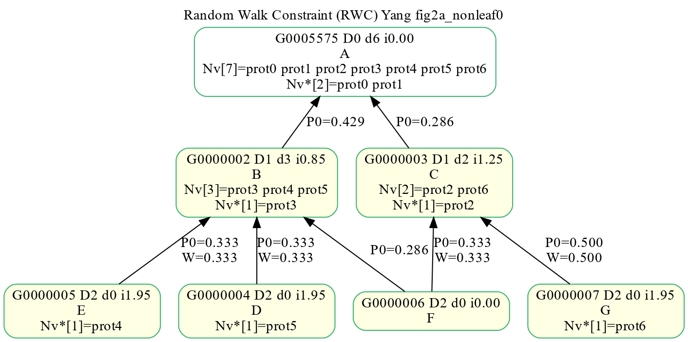
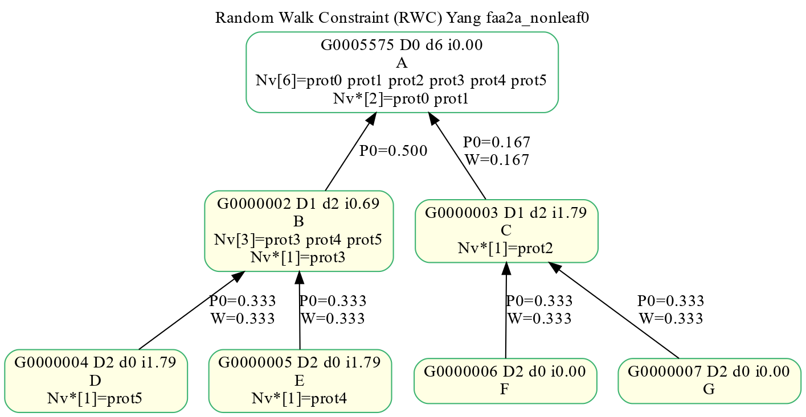
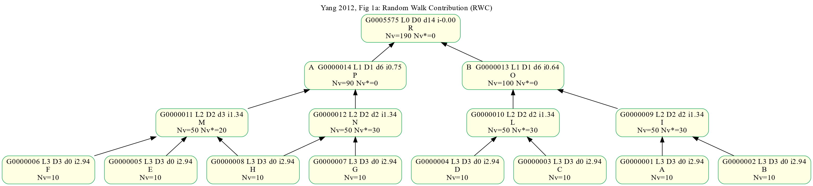
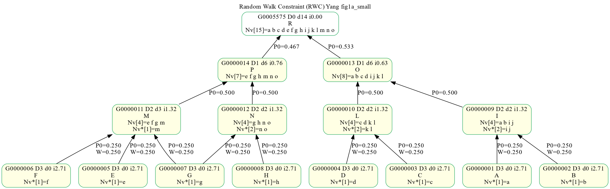
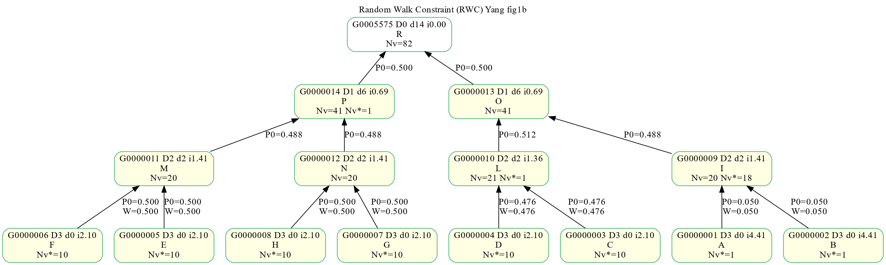

# Yang random walk contribution (RWC) tests
[**Improving GO semantic similarity measures by exploring the ontology beneath the terms and modelling uncertainty**](https://pubmed.ncbi.nlm.nih.gov/22522134)    
Yang, Haixuan et al. Bioinformatics (2012)    

Yang's innovative addition to similarity calculation between two GO terms is to
take into account the descendants of the two GO terms,
leading to greatly imporved similarity measures.

## GO DAGs used to test the Python port of Yang RWC
The [**high-quality Java implementation**](https://github.com/pwac092/gossto) of Yang's RWC semantic similarity addition is described in:    
[**GOssTo: a stand-alone application and a web tool for calculating semantic similarities on the Gene Ontology**](https://pubmed.ncbi.nlm.nih.gov/24659104)   
by first authors,
[**Alfonso E Romero**](https://pubmed.ncbi.nlm.nih.gov/?term=Romero+AE%5BAU%5D) and
[**Horacio Caniza**](https://pubmed.ncbi.nlm.nih.gov/?term=Caniza+H%5BAU%5D).

### Original Yang's Fig 2

#### Yang's Fig 2a GO DAG in GOATOOLS
A total of 100 genes are associated with GO terms.

Note that we swapped node F and G compared to Yang Fig 2.    

#### Fig2a modified: Reduce number of annotations by 10x
We reduced 100 genes to 10 genes (a, b, c, .... h, i, j) for easier testing.

#### Fig2a modified: Gene, a, is explicitly annotated to both B and D

#### Fig2a modified: F is not annotated

#### Simplify: All GO terms have one parent. F is not annotated.

### Original Yang's Fig 1

#### Yang Fig 1a in GOATOOLS

#### Yang Fig 1b in GOATOOLS

